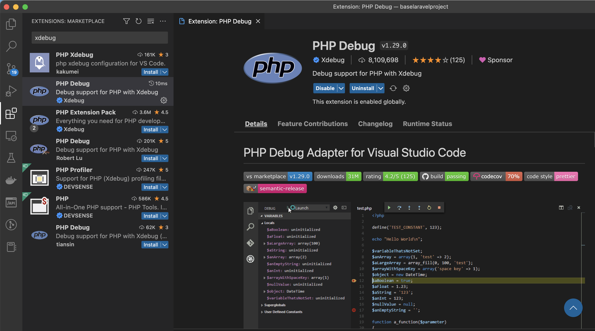
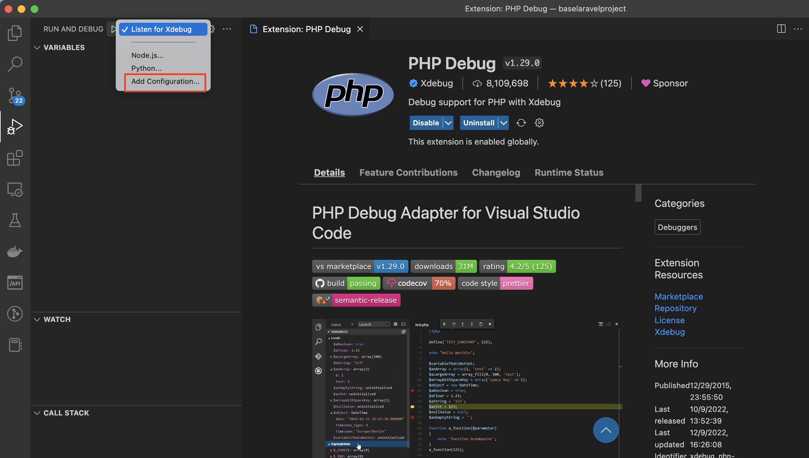
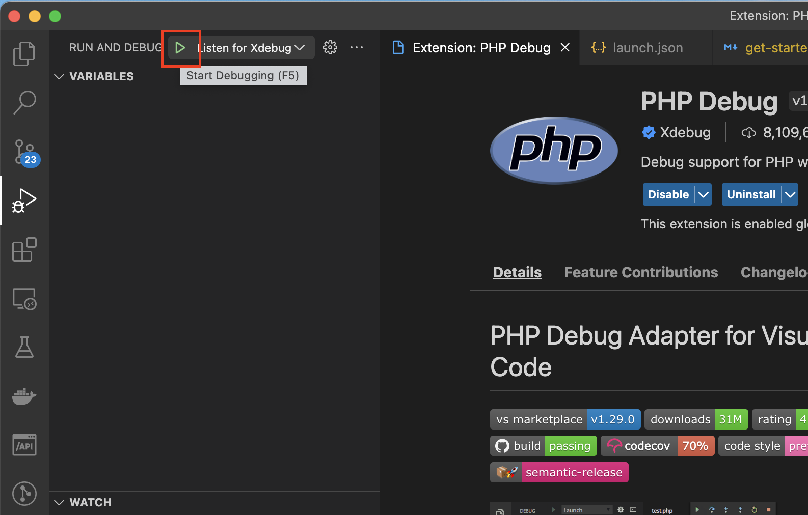

# Get started

## 1. Setup environment
### 1.1 Local environment
* Docker
    * Cài đặt [docker engine](https://docs.docker.com/engine/install/)
    * Hoặc làm theo các bước dưới đây
```bash
# Install Docker Engine
sudo apt-get remove docker docker-engine docker.io containerd runc
sudo apt-get update
sudo apt-get install apt-transport-https ca-certificates curl gnupg-agent software-properties-common
curl -fsSL https://download.docker.com/linux/ubuntu/gpg | sudo apt-key add -
sudo apt-key fingerprint 0EBFCD88
sudo add-apt-repository "deb [arch=amd64] https://download.docker.com/linux/ubuntu $(lsb_release -cs) stable"
sudo apt-get update
sudo apt-get install docker-ce docker-ce-cli containerd.io
sudo groupadd docker
sudo usermod -aG docker $USER
logout
docker -v
```

#### 1.1.1 Set up biến môi trường

```shell
cp .env.example .env 
```

| Key                   | Value                                      |
|-----------------------|--------------------------------------------|
| APP_PORT              | Port của App để expose ra ngoài            |
| DB_USERNAME           | default or random string                   |
| DB_PASSWORD           | default or random string                   |
| DB_HOST               | db - tên service trong file docker-compose |
| DB_EXPOSE_PORT        | Port của DB để expose ra ngoài             |
| APP_ENV               | local                                      |
| APP_DEBUG             | true (nếu muốn sử dụng xDebug)             |
| FRONTEND_LOCAL_DOMAIN | domain để route cho app                    |
| BACKEND_LOCAL_DOMAIN  | domain để route cho backend (admin)        |

Edit file hosts, thêm vào 2 dòng dưới đây

```
127.0.0.1 eduride.frontend.base
127.0.0.1 eduride.backend.base
```

Đây là 2 domain mặc định cho backend và admin. Nếu muốn sử dụng domain khác, thay đổi nội dung file hosts cùng với các biến trong file `.env`

```dotenv
FRONTEND_LOCAL_DOMAIN=eduride.frontend.base
BACKEND_LOCAL_DOMAIN=eduride.backend.base
```

Lưu ý: để thay đổi phương thức Routing này, cần tham khảo **[Routing](routing.md)**

**Production, Staging, Dev environment**

Codebase design để tách biệt backend và admin server khi deploy lên cloud, 1 server sẽ chỉ serve 1 domain duy nhất, tránh việc client frontend có thể request tới admin api thông qua thay đổi uri.

Trong file `.env` config như sau:

```dotenv
APP_ENV=dev # dev|staging|producion
APP_DOMAIN=backend
```

Config `APP_DOMAIN` để chỉ định serve cho domain nào

* frontend: serve frontend api (FRONTEND_LOCAL_DOMAIN)
* backend: serve backend (admin) api (BACKEND_LOCAL_DOMAIN)

#### 1.1.2 Build docker image

```shell
docker compose build
```

#### 1.1.4 Run local environment

```sh
docker compose up -d
```

#### 1.1.5 Generate App Key

```sh
php artisan key:generate
```

#### 1.1.5 Set up xdebug in Visual Studio Code

##### Install PHP Debug Extension



##### Set up launch configuration

Chọn phần debug ở side pannel và thêm configuration cho xdebug như sau



```json5
{
  "version": "0.2.0",
  "configurations": [
    // ...
    {
      "name": "Listen for Xdebug",
      "type": "php",
      "request": "launch",
      "port": 9003,
      "pathMappings": {
        "/var/www": "${workspaceFolder}"
      }
    }
    // ...
  ]
}
```

để debug code php từ trong container. ta cần thêm `pathMapping` từ container đến `workspaceFolder` của host

##### Tạo Firewall rule

```bash
sudo ufw allow in from 172.16.0.0/12 to any port 9003 comment xDebug9000
```

Chọn phần debug ở side pannel và thêm configuration cho xdebug như sau

##### Kiểm tra hoạt động của XDebug

Thêm break point và thực hiện chạy debug ở VS Code



## 2. Installation

### 2.1 Install dependency

Khi khởi tạo lần đầu, Docker sẽ tiến hành tự cài đặt thư viện sử dụng Composer, sau đó nếu muốn chạy lại thì có thể làm theo bước sau

```sh
docker run --rm -v $(pwd):/var/www laravel_local_php composer install
```
* `laravel_local_php` là tên image được tạo ra từ bước build image trước đó (format: `${APP_NAME}_${APP_ENV}_php`)

### 2.2 Laravel Settings
```shell
docker exec --workdir /var/www -it laravel_dev_php php artisan migrate
docker exec --workdir /var/www -it laravel_dev_php php artisan passport:install
docker exec --workdir /var/www -it laravel_dev_php php artisan passport:client --password --provider admins --name admins
docker exec --workdir /var/www -it laravel_dev_php php artisan db:seed
```
